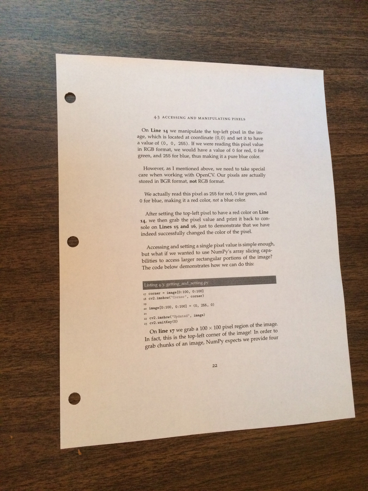

# Document Scanner
### Works by detecting the boundary of the document and getting top-down view of it

Build a sexy document scanner with minimal effort.

All thanks to Adrian Rosebrock (from [pyimagesearch](https://www.pyimagesearch.com/)) for making
great tutorials. This project is inspired from his blog: [How to Build a Kick-Ass Mobile Document Scanner in Just 5 Minutes](https://www.pyimagesearch.com/2014/09/01/build-kick-ass-mobile-document-scanner-just-5-minutes/). I have included the author's code and the one i wrote my self as well.

## **Key Points**
1. Steps involved:
    1. Detect edges.
    2. Use the edges to find the largest rectangular shape objects (this will be the document).
    3. Apply perspective transform to obtain the top-down view of the document.
2. Assumptions:
    1. The app assumes that the document we are scanning is the main focus of the image.
    2. All 4 edges of the document are visible in the image.
    3. The largest rectangle available in the image will be the document. 
3. Used Canny edge detection for detecting the edges in the document.
4. OpenCV has the way to get the top-down view of the image. Used that methodology to get the top-down view.

 ## **Requirements: (with versions i tested on)**
 1. python          (3.7.3)
 2. opencv          (4.1.0)
 3. numpy           (1.61.4)
 4. imutils         (0.5.2)

 ## **Commands to run the detection:**
 For example 1:
 ```
 python scan.py --image images/page.jpg
```

## **Results:**
The results are pretty solid

**input**
___


**Output**
___


## **The issues**
Unfortunately this method has some limitations due to the assumptions stated above. Other than those its a great
approach to such an amazing task.
